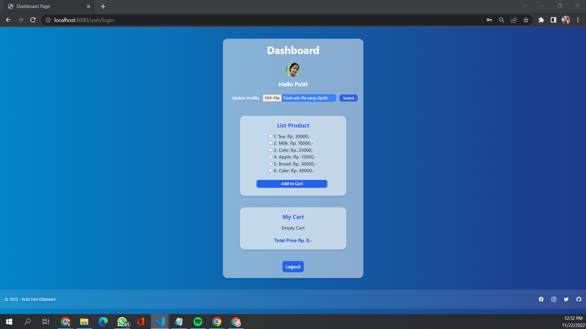

# Cashier App

## Cart Cashier App

### Description

This **Cashier Application** application functions to view a list of products that can be purchased and can add them to any basket while calculating the total price per item that must be paid and the total amount that must be paid. In this application there is a middleware chain to handle Methods and Authentication using session based token methods and then store all user and basket data in JSON files.

The features in this application are:

- Register
- Login
- Add Product to Cart
- View Image Profile
- Update Image Profile
- Logout

### Sreenshots Application

  - Main page (`./views/index.html`):

    

  - Register page (`./views/register.html`):

    

  - Status page (`./views/status.html`):

    

  - Login page (`./views/login.html`):

    

  - Dashboard page (`./views/dashboard.html`):

    

    